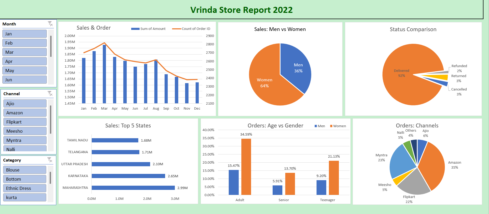

# 📊 Vrinda Store Sales Dashboard (Excel)

An interactive Excel Sales Dashboard built using Pivot Tables, Pivot Charts, Slicers, and Data Visualization techniques.

The dashboard analyzes:
- 📈 Monthly Sales & Order Trends
- 👩 Sales Distribution by Gender
- 📦 Order Status Analysis
- 🏆 Top 5 Performing States
- 👥 Customer Age vs Gender Analysis
- 🛒 Orders by Sales Channel
- 🎛️ Interactive Slicers for dynamic filtering

## 🛠️ Tools Used
- Microsoft Excel
- Pivot Tables
- Pivot Charts
- Slicers
- Data Cleaning
- Data Visualization

## 💡 Skills Demonstrated
- Data Cleaning
- Data Analysis
- Dashboard Development
- Business Intelligence
- Data Visualization
- Excel Reporting

## 📊 Project Insights

- Women customers contributed **64%** of total sales, indicating they are the primary customer segment.
- Approximately **92%** of all orders were successfully delivered, reflecting a high order fulfillment rate.
- **Amazon** was the leading sales channel, contributing **35%** of total orders, followed by Myntra and Flipkart.
- **Maharashtra** generated the highest sales among all states, followed by Karnataka and Uttar Pradesh.
- Adult customers represented the largest customer group, with women making the highest contribution within this segment.
- Sales reached their peak during the **March–April** period and gradually declined towards the end of the year.
- Interactive slicers allow users to analyze sales by **Month, Channel, and Product Category**, enabling dynamic business reporting.

## 🎯 Conclusion

This Excel Sales Dashboard demonstrates how raw sales data can be transformed into meaningful business insights through effective data cleaning, visualization, and reporting.

The analysis identifies key customer segments, top-performing regions, preferred sales channels, and order trends, helping businesses make informed decisions related to marketing, inventory management, and sales strategy.

This project showcases practical skills in **Microsoft Excel, Pivot Tables, Pivot Charts, Slicers, Data Cleaning, Data Visualization, and Business Intelligence**, making it suitable for real-world business reporting and data analytics use cases.

## 📷 Dashboard Preview

## ⭐ If you found this project useful, consider giving it a star!
